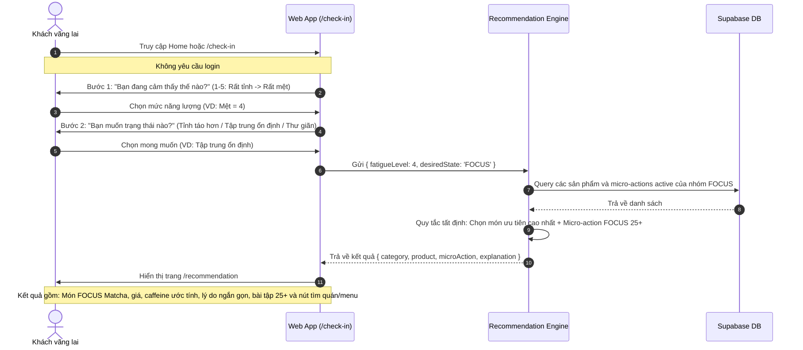
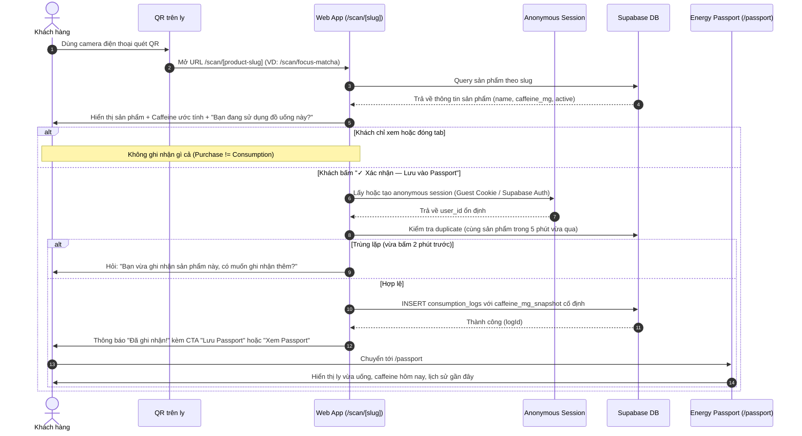
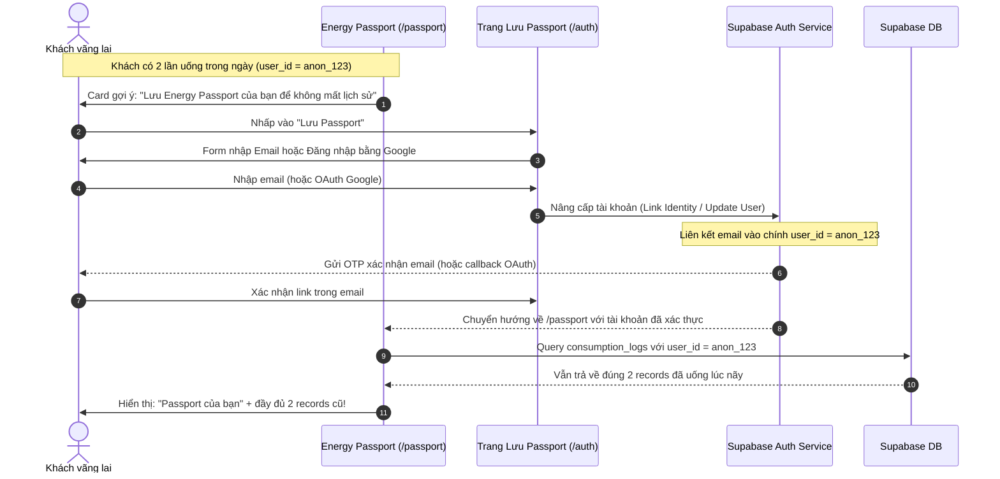
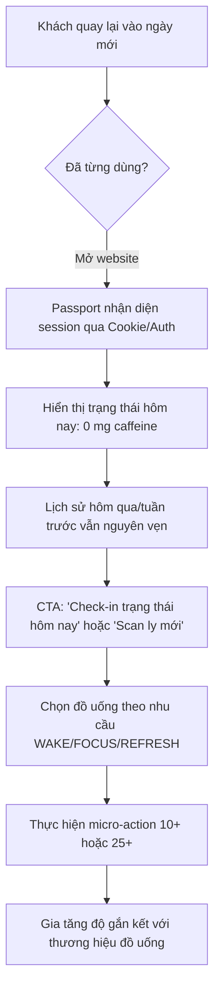

# TARGET PRODUCT FLOWS — Energy Passport MVP

Tài liệu mô tả 4 flow chính trong Core Customer Loop của Energy Passport Web App, trực quan hóa bằng Mermaid.

---

## FLOW A: DISCOVERY → RECOMMENDATION

Khách vãng lai truy cập website, check-in trạng thái bằng ngôn ngữ tự nhiên và nhận gợi ý đồ uống phù hợp cùng micro-action. Không bắt đăng nhập.

---

## FLOW B: QR SCAN → CONSUMPTION (XÁC NHẬN TIÊU THỤ)

Khách đã mua đồ uống (tại quán, qua Grab, ShopeeFood...), quét mã QR in trên tem ly. QR chỉ định danh sản phẩm. Việc ghi nhận chỉ xảy ra khi khách chủ động xác nhận (Purchase ≠ Consumption).

---

## FLOW C: ANONYMOUS → CLAIMED PASSPORT (BẢO TOÀN LỊCH SỬ)

Khách vãng lai đã tích lũy lịch sử tiêu thụ trong Passport tạm thời. Sau khi thấy giá trị, họ quyết định liên kết email hoặc Google để lưu trữ vĩnh viễn. Không mất bất kỳ dữ liệu nào.

---

## FLOW D: RETURNING CUSTOMER (VÒNG LẶP QUAY LẠI)

Tạo thói quen tiêu thụ đồ uống có kiểm soát và gắn kết lâu dài với thương hiệu.

